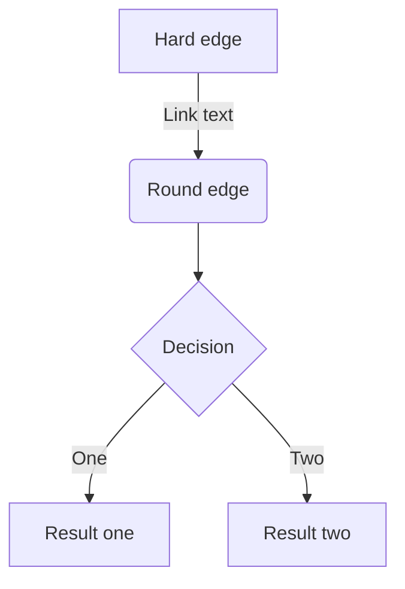
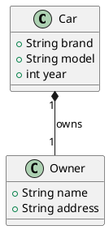
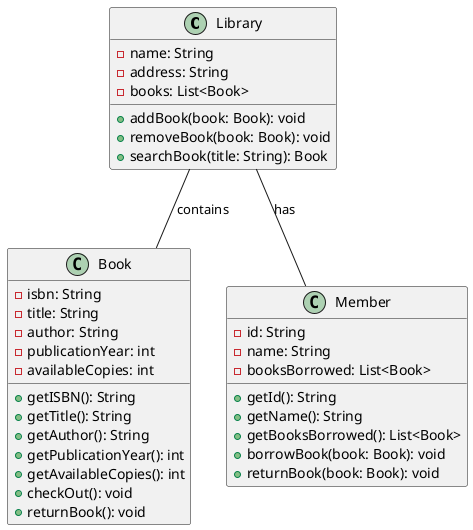

<!-- 
_class: slide-one
-->

# Testing Marp Markdown Presentations

Mohamed Emary

<mohamed21074@fci.bu.edu.eg>

CS Student @BFCAI

---

# Agenda

1.

Let's get started!

---

## Agenda

1. Code Blocks
2. Lists
3. Math Equations
4. Images
5. Tables

Let's get started!

---

# Code Blocks

```python
def hello_world():
    print("Hello World!")

hello_world()
```

This is a code block written in Python

---

# .Net Technologies

.Net is a free, cross-platform, open source developer platform for building many different types of applications.

```csharp
public class HelloWorld
{
    public static void Main()
    {
        Console.WriteLine("Hello World!");
    }
}
```

---

# JavaScript

1. JavaScript is a programming language that adds interactivity to your website.
2. JavaScript is a scripting language.
3. JavaScript is the programming language of the Web.
4. JavaScript is easy to learn.
5. you can use `console.log()` to print to the console.

---

# Some Equations

$$
\begin{aligned}
\frac{d}{dx}\left( \int_{0}^{x} f(u)\,du\right)=f(x)\\
\frac{d}{dx}\left( \int_{x}^{0} f(u)\,du\right)=-f(x)
\end{aligned}
$$

---
<!-- _backgroundColor: #dfdfdf 
-->

# Tables

| Slide | Description        | Type      |
| ----- | ------------------ | --------- |
| 1     | Code Blocks        | Code      |
| 2     | Lists              | Text      |
| 3     | Math Equations     | Math      |
| 4     | Images             | Text      |
| 5     | Tables             | Text      |
| 6     | Equations $\to e=mc^2$ | Equations |

---

# Statistical Analysis Formulas

---

* $$ \text{Mean} = \frac{\sum_{i=1}^{n} x_i}{n} $$
* $$ \text{Median} = \frac{n + 1}{2} $$
* $$ \text{Mode} = \text{The value that appears most often in a set of data} $$

---

* $$ \text{Variance} = \frac{\sum_{i=1}^{n} (x_i - \bar{x})^2}{n-1}$$

* $$ \text{Standard Deviation} = \sqrt{\frac{\sum_{i=1}^{n} (x_i - \bar{x})^2}{n-1}}$$

---

# Some Code

```js {1,2,4-5}
function foo() {
  return bar()
    .then(res => {
      return res.doSomething()
    })
}
```

---

# Diagrams

<div class="columns" style="text-align:center;">

<div>



</div>

<div>



</div>
</div>

---

# You can use Font awesome icons

<div style="font-size: 3rem;">

* <i class="fa fa-github"></i> Github
* <i class="fa fa-reddit"></i> Reddit
* <i class="fa fa-twitter"></i> Twitter
* <i class="fa fa-facebook"></i> Facebook

</div>

---

* <i class="fa fa-amazon"></i> Amazon
* <i class="fa fa-cc-visa"></i> Visa
* <i class="fa fa-cc-mastercard"></i> Mastercard
* <i class="fa fa-university"></i> university
* <i class="fa fab fa-cc-paypal"></i> Amazon Pay
* <i class="fa fa-opencart"></i> Open Cart

---

# Some Extra Math Formulas

* RelU Function

$$
f(x) = max(0, x)
$$

* Sigmoid Function

$$
f(x) = \frac{1}{1 + e^{-x}}
$$

* Softmax Function

$$
f(x) = \frac{e^{x_i}}{\sum_{j=1}^{k} e^{x_j}}
$$

---

# Two Columns

<div class="columns">
<div>

* one
* two
* three

</div>
<div>

* four
* five
* six

</div>
</div>

---

# JavaScript Code

```js {1,3,8-10}
function foo() {
  return bar()
    .then(res => {
      return res.doSomething()
    })
}

function bar() {
  return Promise.resolve({ doSomething: () => {} })
}
```

---

# Matrix Multiplication

$$
\begin{bmatrix}
    1 & 2 & 3 \\
    4 & 5 & 6 \\
    7 & 8 & 9
\end{bmatrix}
\times
\begin{bmatrix}
    1 & 2 & 3 \\
    4 & 5 & 6 \\
    7 & 8 & 9
\end{bmatrix} = \begin{bmatrix}30 & 36 & 42\\66 & 81 & 96\\102 & 126 & 150\end{bmatrix}
$$

---

# Equations

<div class="columns">

<div>

$$
\sigma = \frac{1}{1 + e^{-x}}
$$

$$

\begin{aligned}
\frac{d}{dx}\left( \int_{0}^{x} f(u)\,du\right)=f(x)\\
\frac{d}{dx}\left( \int_{x}^{0} f(u)\,du\right)=-f(x)
\end{aligned}
$$

</div>
<div>

$$
\sigma = \frac{1}{1 + e^{-x}}
$$

$$
\begin{aligned}
\frac{d}{dx}\left( \int_{0}^{x} f(u)\,du\right)=f(x)\\
\frac{d}{dx}\left( \int_{x}^{0} f(u)\,du\right)=-f(x)
\end{aligned}
$$

</div>
</div>

---

# Library Management System Class Diagram

<div style="text-align: center;">



</div>

---

* <i class="fa fa-amazon"></i> Amazon
* <i class="fa fa-cc-visa"></i> Visa
* <i class="fa fa-cc-mastercard"></i> Mastercard

---

# Emojis

## To infinity and beyond! :rocket:

## This is a :smile: emoji

## This is a duck :duck:

---

# Summations $\sum$

$$
\sum_{x=0}^{10}{x^2}  = 385
$$

$$
\begin{bmatrix}
  6 & 5 & 2\\
  1 & 5 & 72\\
  1 & 8 & 3\\
\end{bmatrix}\cdot \begin{bmatrix}
  5 & 4 & 7\\
  5 & 2 & 1\\
  7 & 5 & 2\\
\end{bmatrix} = \begin{bmatrix}69 & 44 & 51\\534 & 374 & 156\\66 & 35 & 21\end{bmatrix}
$$

$$
\frac{x^2+2x}{x} = x + 2
$$

$$
\lim_{x\to0}\frac{x^2+2x}{x}  = x + 2= 2
$$

---

$$
\begin{aligned}
\text{Input: }& x_1, x_2, \ldots, x_n \\
\text{Output: }& y_1, y_2, \ldots, y_m \\
\text{Weights: }& w_{ij} \\
\text{Bias: }& b_j \\
\text{Activation: }& a_j = \sum_i w_{ij} x_i + b_j \\
\text{Output: }& y_j = f(a_j) \\
\text{Error: }& E = \frac{1}{2} \sum_j (y_j - t_j)^2 \\
\end{aligned}
$$

---

$$
\begin{aligned}
\text{Gradient Descent: }& w_{ij} \leftarrow w_{ij} - \eta \frac{\partial E}{\partial w_{ij}} \\
\text{Gradient Descent: }& b_j \leftarrow b_j - \eta \frac{\partial E}{\partial b_j} \\
\text{Gradient Descent: }& \frac{\partial E}{\partial w_{ij}} = (y_j - t_j) f'(a_j) x_i \\
\text{Gradient Descent: }& \frac{\partial E}{\partial b_j} = (y_j - t_j) f'(a_j) \\
\end{aligned}
$$

---

<!-- _class: last -->

# Thank You
