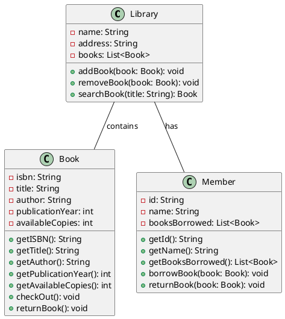

<!-- 
_class: slide-one
-->

# Testing Marp Markdown Presentations

Mohamed Emary

<mohamed21074@fci.bu.edu.eg>

CS Student @BFCAI

---

# Agenda

1. Code Blocks
2. Lists
3. Math Equations
4. Tables
5. Diagrams
6. Emojis & Font Awesome Icons
7. Images
8. Two Columns Format

Let's get started!

---

# Code Blocks With Syntax Highlighting & Line Highlighting

```python {1,3}
def hello_world():
    print("Hello World!")

hello_world()
```

This is a code block written in Python & the first line is highlighted.

---

# Lists

There is two types of lists:

- Fragmented List
- Ordered List

This is for both ordered and unordered lists.

Fragmented Lists appear one by one while ordered lists appear all at once.

---

## Fragmented bullet List

<!-- markdownlint-disable -->
* one
* two
* three
<!-- markdownlint-enable -->

We use `*` to create a fragmented bullet list.

---

## Ordinary bullet List

- one
- two
- three

We use `-` to create an ordinary bullet list.

---

## Fragmented Numbered List

1) one
2) two
3) three

We use `1)` to create a fragmented numbered list.

---

## Ordinary Numbered List

1. one
2. two
3. three

We use `1.` to create an ordinary numbered list.

---

# Some Equations

We can use complex $\LaTeX$ equations as below:

$$
\begin{align*}
\int_{0}^{\infty} \left( \frac{\sin x}{x} \right)^2 \, dx &= \frac{1}{2} \sqrt{\frac{\pi}{2}} \\
&= \frac{1}{2} \left( \frac{\Gamma\left(\frac{1}{4}\right)}{\sqrt{2}} \right)^2 \\
&= \frac{1}{2} \left( \frac{\Gamma\left(\frac{1}{4}\right)\Gamma\left(\frac{3}{4}\right)}{\sqrt{2}\Gamma\left(\frac{3}{4}\right)} \right)^2 \\
\end{align*}
$$

---

# Tables

We can also create tables as below:

| Slide Number | Description                 |
| ------------ | --------------------------- |
| 3            | Code Blocks                 |
| 4            | Lists                       |
| 9            | Equations Like $\to e=mc^2$ |
| 10           | Tables                      |

If you want a complex table that can't be created using markdown, you can use HTML tables.

---

# Diagrams

We can use diagrams like mermaid, plantuml, etc. Just like the following:

<div style="text-align: center;">



</div>

---

# Emojis & Font Awesome Icons

You can use emojis like :smile: and Font Awesome Icons like <i class="fab fa-github"></i> as below:

- I love Github <i class="fab fa-github"></i>
- To infinity and beyond! :rocket:

---

# Images

You can add images like below:


---

# Two Columns

You can create use two columns format like below:

<div class="columns">
<div>

## Column One

- one
- two
- three

</div>
<div>

## Column Two

- four
- five
- six

</div>
</div>

---

<!-- _class: last -->

# Thank You
